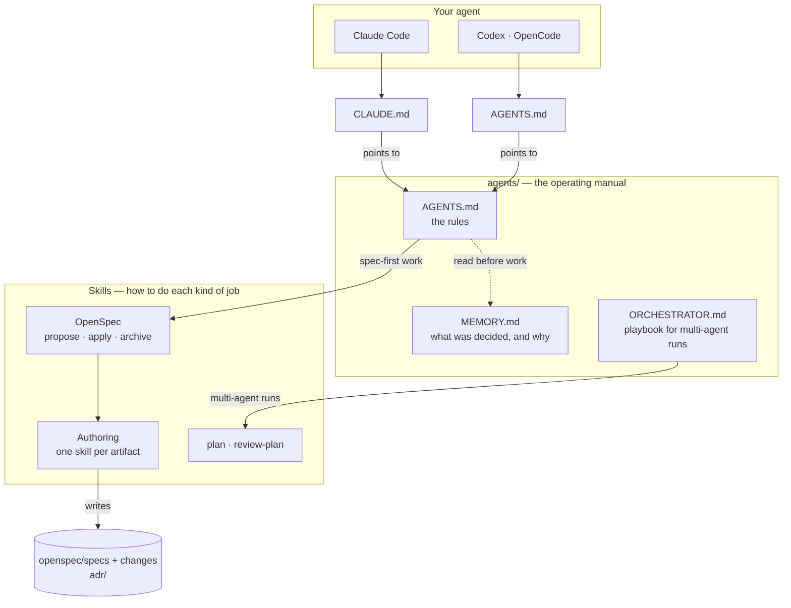
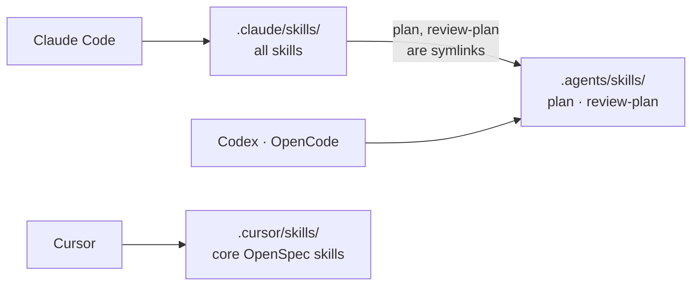
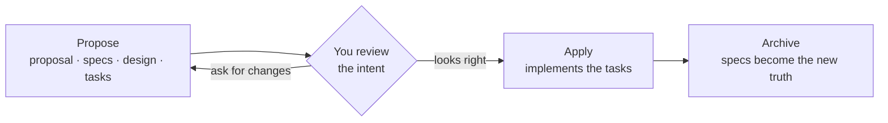
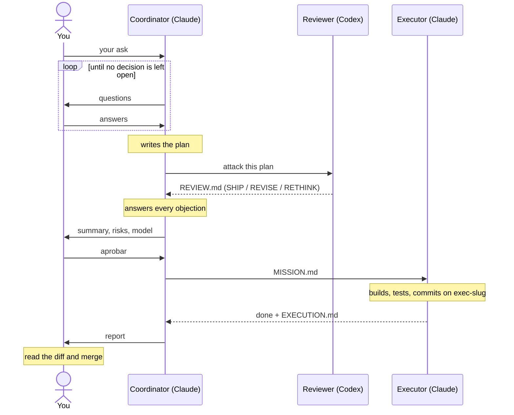

# Agentic project template

A project template that tells AI coding agents **how to work** in it: agree on
what to build before building it, keep a record of what was decided, and have
one model's plan checked by another before anything runs.

You don't learn commands to use it. You open the repo with your agent (Claude
Code, Codex, OpenCode or Cursor) and say what you want. The files below are
what the agent reads to know what to do.

---

## How it fits together

Every agent starts at a **pointer file**, reads the **operating manual** in
`agents/`, and uses **skills** for the actual work. What gets built is recorded
as **specs**; big decisions are recorded as **ADRs**.

---

## The pieces

### Entry points: `CLAUDE.md` and `AGENTS.md`

Two identical, tiny files at the root. Each harness looks for its own name
(Claude Code reads `CLAUDE.md`; Codex and OpenCode read `AGENTS.md`), and both
say the same thing: *the rules are in `agents/`, read them before doing
anything.* They hold no rules themselves, so there is one manual, not three.

### `agents/AGENTS.md` — the rules

How work happens here, for every agent:

- **Spec-first.** Nothing is implemented without an approved OpenSpec change.
  If you ask for a feature, the agent proposes it first and waits for your
  review.
- **Git gates.** A proposal reaches `main` before it is applied; a change is
  archived only from `main`, after the code is merged. Agents never commit,
  push or merge without your OK, and never add co-author lines.
- **Safety.** No secrets in the repo, no editing live specs by hand, no
  force-push to `main`, and honest reporting when something wasn't verified.

### `agents/MEMORY.md` — the decision log

The facts and decisions that aren't requirements: why the repo is set up this
way, infrastructure facts, gotchas found along the way. Dated, newest first,
append-only. Agents read it before working and add to it after meaningful
changes, so the next session (or the next person) doesn't have to rediscover
them.

Each kind of knowledge has one home:

| Knowledge | Lives in | Example |
|---|---|---|
| What the system does | `openspec/specs/` | "The CLI greets the user by name" |
| How we work | `agents/AGENTS.md` | "No code without an approved change" |
| Facts and decisions | `agents/MEMORY.md` | "2026-09-23: commit attribution is off" |
| Architecture decisions | `adr/` | "0001: use SQLite for the local store" |
| Plans for a piece of work | `~/repos/plans/`, outside the repo | `PLAN.md`, `MISSION.md` |

### Skills — how each job is done

A skill is a set of instructions an agent loads when a task matches it. The
rules say *what* must happen; skills say *how*.

| Family | Skills | What they do |
|---|---|---|
| **OpenSpec workflow** | `openspec-propose`, `-apply-change`, `-archive-change`, `-explore`, `-verify-change`, … and the `/opsx:*` commands | Run the spec-first loop: write a change, implement it, fold it into the specs |
| **Authoring** | `grill-me`, `gherkin-authoring`, `c4-diagrams`, `architectural-decision-records` | Each writes one artifact of a change: it questions you on the proposal, writes specs as scenarios, draws the design, records ADRs |
| **Quality** | `openspec-git-discipline`, `adversarial-authoring` | Enforce the git gates; have one subagent draft and another attack the draft |
| **Planning** | `plan`, `review-plan` | Turn an ask into a plan another model can execute alone, then red-team it with a different model |

Where they live:

`plan` and `review-plan` are the skills every harness needs, so they live once
in `.agents/skills/` and Claude Code reaches them through symlinks. Everything
else is Claude Code–first; Cursor gets the core OpenSpec loop.

### `agents/ORCHESTRATOR.md` — multi-agent runs

The playbook for one agent to coordinate others in [Orca](https://www.onorca.dev/).
Only the coordinator reads it. It turns the `plan` and `review-plan` skills
into a pipeline with a human gate in the middle.

---

## How work flows

### Spec-first, with one agent

Ask for a feature. The agent proposes a change, you review the intent, it
implements, and the specs are updated:

You review **intent**, a short spec delta, instead of reverse-engineering it
from a diff.

### Orchestrated, with three agents

For bigger or riskier work, a coordinator plans with you, a *different* model
attacks the plan, and a third agent executes it on its own branch. You answer
questions, approve, and merge:

To start one, open the repo in Orca and tell Claude: *"Read
`agents/ORCHESTRATOR.md` and act as the coordinator for: …"*.

When the work changes what the system does, the orchestrated run still goes
through OpenSpec: the mission either applies a change already on `main` or
proposes one first.

---

## Learn more

| If you want… | Read |
|---|---|
| Setup, the full orchestration flow, the plan files and the project structure | [`docs/how-it-works.md`](docs/how-it-works.md) |
| The exact rules agents follow | [`agents/AGENTS.md`](agents/AGENTS.md) |
| The coordinator's playbook (Spanish) | [`agents/ORCHESTRATOR.md`](agents/ORCHESTRATOR.md) |
| Why things are the way they are | [`agents/MEMORY.md`](agents/MEMORY.md) |

**Using it for your own project:** clone it, replace `PROJECT_NAME` and the
`TODO`s, and ask your agent for the first feature. Details in
[`docs/how-it-works.md`](docs/how-it-works.md#setup).

---

## License

[MIT](LICENSE). Use it, change it, ship it; keep the copyright notice.
