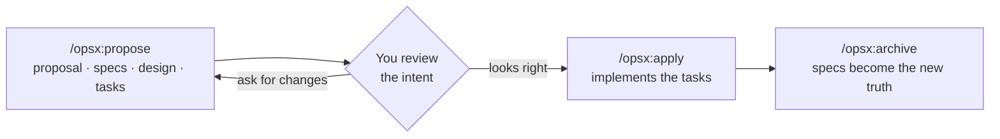
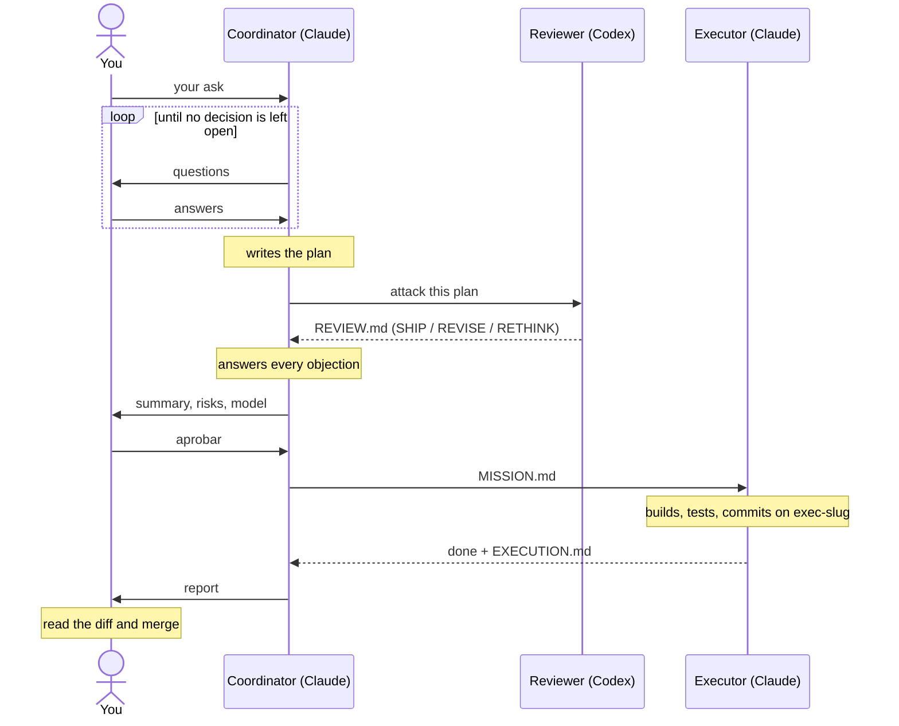

# Agentic project template

A project template where AI agents **agree on what to build before building
it**, and where one model's plan is checked by another before anything runs.
Works with Claude Code, Codex, OpenCode and Cursor.

You get two ways to work:

- **Spec-first, with one agent.** Every change starts as a short proposal
  (intent, specs, design, tasks) that you review before any code is written.
  Powered by [OpenSpec](https://openspec.dev).
- **Orchestrated, with three agents.** Claude plans with you, Codex attacks the
  plan, you approve, and another Claude executes it in its own branch. You only
  answer questions, approve, and merge.

---

## Quick start (5 minutes)

**You need:** Node.js ≥ 20.19 and Claude Code (or Cursor).

```bash
npm install -g @fission-ai/openspec@latest   # once
git clone https://github.com/piotromashov/template.git my-project && cd my-project
claude
```

Then, inside Claude Code:

```
/opsx:propose "a CLI that greets the user by name"
```

You'll get a folder in `openspec/changes/` with a proposal, specs, a design and
a task list. Read it and ask for changes. When it looks right:

```
/opsx:apply      ← implements the tasks
/opsx:archive    ← merges the specs, files the change
```

That's the whole loop:



---

## Try the orchestrated mode

For bigger or riskier work. **You also need:** [Orca](https://www.onorca.dev/)
with orchestration on (Settings → Experimental) and the
[Codex CLI](https://github.com/openai/codex) logged in.

```bash
mkdir -p ~/repos/plans      # where plans live, outside the repo
```

Open the repo in Orca, start `claude` in the main tab, and say:

> Read `agents/ORCHESTRATOR.md` and act as the coordinator for this: *&lt;your ask&gt;*

What happens next — you only answer, approve and merge:



If a run gets stuck on a permission prompt the first time, see
[Orchestration setup](docs/how-it-works.md#orchestration-setup).

**No Orca?** The pieces work on their own: ask Claude to *"use the `plan`
skill for: …"*, ask Codex to *"use the `review-plan` skill on
`~/repos/plans/<date>-<slug>/`"*, then paste `MISSION.md` into a fresh session.

---

## Learn more

| If you want to… | Read |
|---|---|
| Understand every framework in the template, the orchestration roles and flow, and the plan files | [`docs/how-it-works.md`](docs/how-it-works.md) |
| Know the rules agents follow here (workflow, git gates, safety) | [`agents/AGENTS.md`](agents/AGENTS.md) |
| See the coordinator's own playbook (Spanish) | [`agents/ORCHESTRATOR.md`](agents/ORCHESTRATOR.md) |
| See why things are the way they are | [`agents/MEMORY.md`](agents/MEMORY.md) |

---

## Use it for your own project

1. Replace **`PROJECT_NAME`** in `CLAUDE.md`, `AGENTS.md`, `agents/AGENTS.md`,
   `agents/MEMORY.md` and `adr/README.md`, and rewrite this README.
2. Fill in the `TODO`s (description, stack, build/run/test, license).
3. Trim `.gitignore` to your stack.
4. `/opsx:propose "your first feature"`.

On Windows, clone with `git config --global core.symlinks true` so the shared
skills resolve ([why](docs/how-it-works.md#project-structure)).

---

## License

<!-- FILL IN: e.g. MIT. Add a LICENSE file. -->
_TODO_
