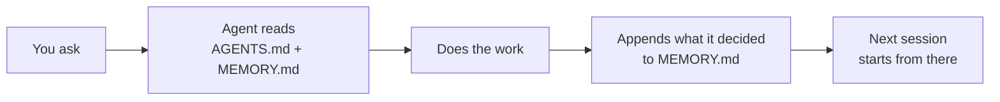
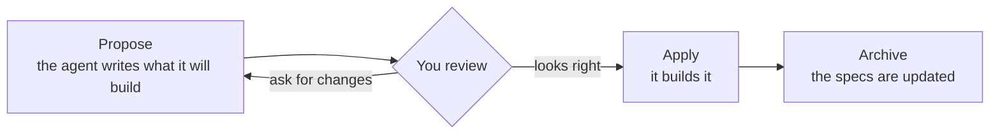
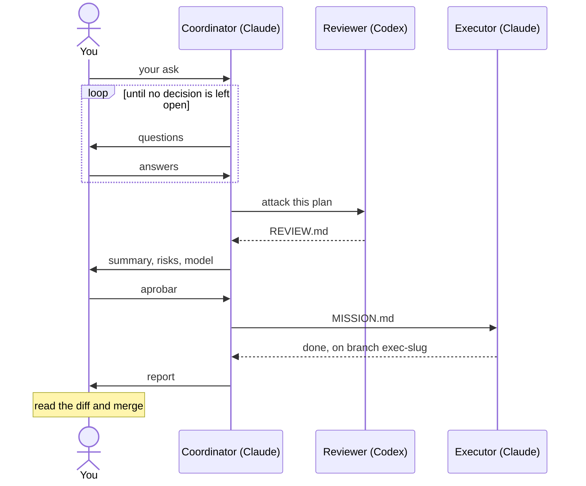

# Agentic project template

A ready-made repo for building software **with AI coding agents**: Claude Code,
Codex, OpenCode or Cursor. Clone it, open it with your agent, and the agent
already knows how to work here: it agrees with you on *what* to build before
writing code, keeps a log of what was decided, and can hand bigger jobs to a
team of agents that check each other's work.

---

## Start in three steps

```bash
npm install -g @fission-ai/openspec@latest                                  # once
git clone https://github.com/piotromashov/template.git my-project && cd my-project
claude    # or codex, opencode, or open the folder in Cursor
```

Then say what you want. Pick the level that matches the task:

| Level | Use it when | You say |
|---|---|---|
| [**1. Just ask**](#level-1-just-ask) | Questions, docs, tooling, chores: anything that doesn't change what the system does | *"Add Prettier and a `format` script."* |
| [**2. Spec-first**](#level-2-spec-first) | A feature, a fix, any change in behaviour | *"… Propose it."* |
| [**3. Orchestration**](#level-3-orchestration) | Big or risky work you want to hand to a team of agents, and only approve and merge | *"Act as the coordinator for: …"* |

The agent picks up the rules at every level: at level 1 it will tell you when
something needs a spec, and at level 3 the team still goes through level 2
for behaviour changes.

---

## Level 1: Just ask

**Use it when** you have a question, or work that doesn't change what the
system does: documentation, tooling, scripts, configuration, small operations.
Works in Claude Code, Codex, OpenCode and Cursor, with nothing else installed.

**Examples**

> Add Prettier and a `format` script.

> What formatter do we use, and why?

> Explain how the CLI is structured.

**Workflow.** Before doing anything, the agent reads the rules in
`agents/AGENTS.md` and the decision log in `agents/MEMORY.md`, so it works the
way this repo works and doesn't redo what was already decided. When it
settles something new, it appends a dated entry to `MEMORY.md`. The next
session, or the next person, starts from there.



If the ask turns out to change behaviour, the agent says so and proposes it
instead (level 2). That's the rule, not a judgment call.

Walkthrough: [Everyday work, with memory](docs/examples.md#1-everyday-work-with-memory).

---

## Level 2: Spec-first

**Use it when** you want a new behaviour, a fix, or a change and you're
driving. This is the default for anything the system *does*.

**Examples**

> I want a small CLI that greets the user by name. Propose it.

> Explore how we could add multiple languages.

> Apply it. &nbsp;·&nbsp; Archive it. &nbsp;·&nbsp; What changes are in flight?

**Workflow.** The agent asks a few questions, writes a short proposal with the
expected behaviour as scenarios, and waits for your OK before touching code.
You review **intent**, a short spec, instead of reverse-engineering it from a
diff. When it's built and merged, the specs become the record of what the
system does.



Walkthrough: [Add a feature, spec-first](docs/examples.md#2-add-a-feature-spec-first).

---

## Level 3: Orchestration

**Use it when** the work is big, crosses several parts of the system, or is
risky enough that you want a *different* model to attack the plan before
anyone executes it, and you'd rather approve than drive. Needs
[Orca](https://www.onorca.dev/) with orchestration on, Claude Code and the
Codex CLI.

**Examples**

> Act as the coordinator for: set up CI that runs the tests on every pull
> request.

> Act as the coordinator for: let users pick the greeting language with
> `--lang es|en`.

**Workflow.** A coordinator grills you until no decision is left open and
writes a plan (`plan` skill). Codex reads it cold and attacks it
(`review-plan` skill); the coordinator answers every finding. You approve at
a gate. An executor builds it on its own branch, so nothing lands on `main`
without you. You answer questions, approve, and merge.



When the work changes what the system does, the run still goes through level
2: the mission either applies a spec-first change already on `main` or
proposes one first.

**Without Orca**, the two skills work on their own: *"Use the `plan` skill
for: …"* in Claude Code, *"Use the `review-plan` skill on `~/repos/plans/…`"*
in Codex, then paste `MISSION.md` into a fresh session.

Walkthroughs: [Plan and review without Orca](docs/examples.md#3-plan-and-review-without-orca),
[Hand off a chore to three agents](docs/examples.md#4-hand-off-a-chore-to-three-agents)
and [Orchestrate a feature](docs/examples.md#5-orchestrate-a-feature).

---

## What's in the box

| Piece | What it does |
|---|---|
| **`CLAUDE.md`, `AGENTS.md`** | Entry points. Each agent reads its own and is sent to `agents/` |
| **`agents/AGENTS.md`** | The rules: spec-first, git gates, safety. No code without an approved change |
| **`agents/MEMORY.md`** | The decision log, so the next session doesn't rediscover things |
| **`agents/ORCHESTRATOR.md`** | Playbook for the coordinator in level 3 |
| **Skills** (`.claude/`, `.agents/`, `.cursor/`) | How each job is done: the OpenSpec loop, one skill per artifact, `plan` and `review-plan` |
| **`openspec/`, `adr/`** | What the system does (specs) and the architecture decisions behind it |

---

## Go deeper

| If you want… | Read |
|---|---|
| Walkthroughs of every level, from the first sentence to the merge | [`docs/examples.md`](docs/examples.md) |
| How the pieces fit, orchestration in detail, setup, project structure | [`docs/how-it-works.md`](docs/how-it-works.md) |
| The exact rules agents follow | [`agents/AGENTS.md`](agents/AGENTS.md) |
| Why things are the way they are | [`agents/MEMORY.md`](agents/MEMORY.md) |

**Making it yours:** replace `PROJECT_NAME` and the `TODO`s, trim
`.gitignore`, and ask for your first feature. Details in
[`docs/how-it-works.md`](docs/how-it-works.md#setup).

---

## License

[MIT](LICENSE). Use it, change it, ship it; keep the copyright notice.
