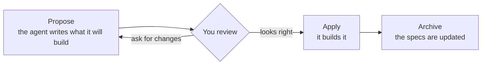

# Agentic project template

A ready-made repo for building software **with AI coding agents**: Claude Code,
Codex, OpenCode or Cursor. Clone it, open it with your agent, and the agent
already knows how to work here: it agrees with you on *what* to build before
writing code, keeps a log of what was decided, and can hand bigger jobs to a
team of agents that check each other's work.

---

## Start in three steps

```bash
npm install -g @fission-ai/openspec@latest                                  # once
git clone https://github.com/piotromashov/template.git my-project && cd my-project
claude    # or codex, opencode, or open the folder in Cursor
```

Then say what you want:

> I want a small CLI that greets the user by name. Propose it.

The agent asks you a few questions, writes a short proposal with the expected
behaviour, and waits for your OK before touching code. When it looks right,
say *"Apply it."* When it's merged, say *"Archive it."*



That's the everyday loop. You review **intent**, a short spec, instead of
reverse-engineering it from a diff.

---

## Examples

Walkthroughs of what you say, what the agent does and what you check are in
[`docs/examples.md`](docs/examples.md):

| Say | What happens |
|---|---|
| *"I want a small CLI that greets the user by name. Propose it."* | A proposal with specs appears for you to review, then the agent builds it |
| *"Explore how we could add multiple languages."* | The agent thinks it through with you before proposing anything |
| *"Read `agents/ORCHESTRATOR.md` and act as the coordinator for: set up CI."* | Three agents: one plans with you, another attacks the plan, a third builds it on its own branch. You approve and merge |
| *"Use the `plan` skill for: migrate to ES modules."* | A plan another agent (or person) can execute without asking anything |

---

## What's in the box

| Piece | What it does |
|---|---|
| **`CLAUDE.md`, `AGENTS.md`** | Entry points. Each agent reads its own and is sent to `agents/` |
| **`agents/AGENTS.md`** | The rules: spec-first, git gates, safety. No code without an approved change |
| **`agents/MEMORY.md`** | The decision log, so the next session doesn't rediscover things |
| **`agents/ORCHESTRATOR.md`** | Playbook for a coordinator agent that runs a three-agent job |
| **Skills** (`.claude/`, `.agents/`, `.cursor/`) | How each job is done: the OpenSpec loop, one skill per artifact, `plan` and `review-plan` |
| **`openspec/`, `adr/`** | What the system does (specs) and the architecture decisions behind it |

Bigger or riskier work can go through **orchestration** in
[Orca](https://www.onorca.dev/): a coordinator plans with you, a *different*
model reviews the plan, you approve at a gate, and an executor builds it on its
own branch. You only answer questions, approve, and merge.

---

## Go deeper

| If you want… | Read |
|---|---|
| Walkthroughs of both flows, from the first sentence to the merge | [`docs/examples.md`](docs/examples.md) |
| How the pieces fit, orchestration in detail, setup, project structure | [`docs/how-it-works.md`](docs/how-it-works.md) |
| The exact rules agents follow | [`agents/AGENTS.md`](agents/AGENTS.md) |
| Why things are the way they are | [`agents/MEMORY.md`](agents/MEMORY.md) |

**Making it yours:** replace `PROJECT_NAME` and the `TODO`s, trim
`.gitignore`, and ask for your first feature. Details in
[`docs/how-it-works.md`](docs/how-it-works.md#setup).

---

## License

[MIT](LICENSE). Use it, change it, ship it; keep the copyright notice.
