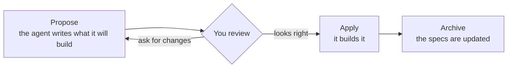
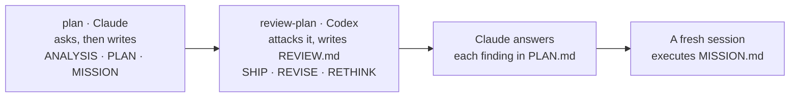
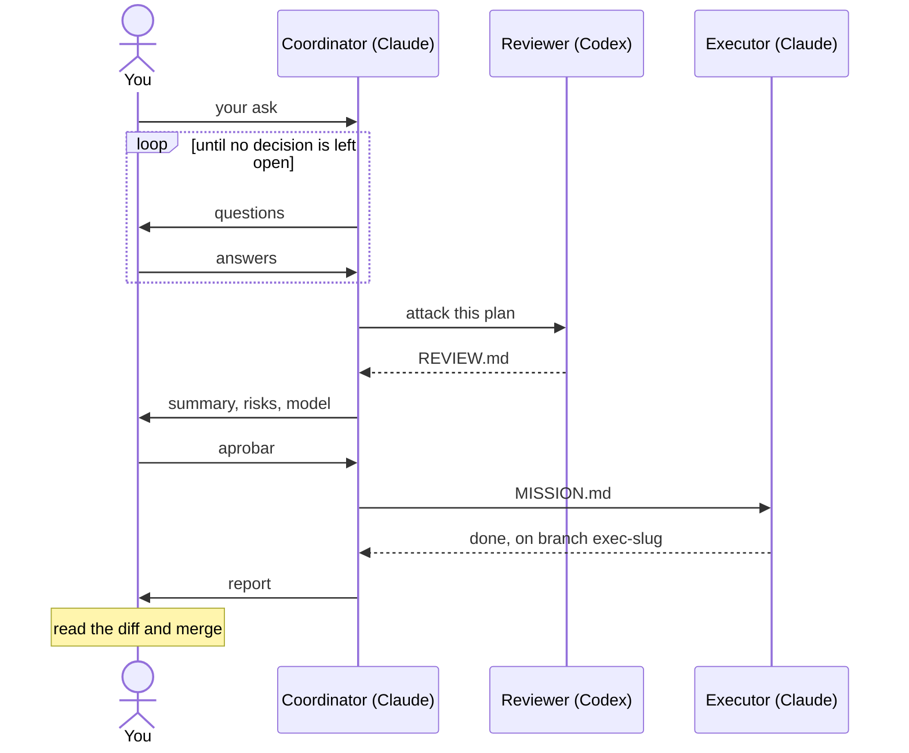

# Agentic project template

A ready-made repo for building software **with AI coding agents**: Claude Code,
Codex, OpenCode or Cursor. Clone it, open it with your agent, and the agent
already knows how to work here: it agrees with you on *what* to build before
writing code, keeps a log of what was decided, and can hand bigger jobs to a
team of agents that check each other's work.

---

## Start in three steps

```bash
npm install -g @fission-ai/openspec@latest                                  # once
git clone https://github.com/piotromashov/template.git my-project && cd my-project
claude    # or codex, opencode, or open the folder in Cursor
```

Then say what you want. Pick the level that matches the size of the task:

| Level | Use it when | You say |
|---|---|---|
| [**1. Spec-first**](#level-1-spec-first-the-everyday-loop) | Any feature or change. Your default | *"… Propose it."* |
| [**2. Plan and review**](#level-2-plan-and-review) | The work is big enough that you want a second model to check the plan | *"Use the `plan` skill for: …"* |
| [**3. Orchestration**](#level-3-orchestration) | You want to hand the whole thing to a team of agents and only approve and merge | *"Read `agents/ORCHESTRATOR.md` and act as the coordinator for: …"* |

Each level builds on the one before: a plan can wrap a spec-first change, and
an orchestrated run is a plan with the agents doing the legwork.

---

## Level 1: Spec-first, the everyday loop

**Use it when** you want a new behaviour, a fix, or a change and you're
driving. Works in Claude Code, Codex, OpenCode and Cursor.

**Examples**

> I want a small CLI that greets the user by name. Propose it.

> Explore how we could add multiple languages.

> Apply it. &nbsp;·&nbsp; Archive it. &nbsp;·&nbsp; What changes are in flight?

**Workflow.** The agent asks a few questions, writes a short proposal with the
expected behaviour as scenarios, and waits for your OK before touching code.
You review **intent**, a short spec, instead of reverse-engineering it from a
diff. When it's built and merged, the specs become the record of what the
system does.



Walkthrough: [Add a feature, spec-first](docs/examples.md#1-add-a-feature-spec-first).

---

## Level 2: Plan and review

**Use it when** the work crosses several parts of the system, touches
something deployed, or is ambiguous enough that a wrong reading costs real
time, and you want a *different* model to attack the plan before anyone
executes it. Needs Claude Code and the Codex CLI; no Orca.

**Examples**

> Use the `plan` skill for: migrate the CLI from CommonJS to ES modules.

> Use the `review-plan` skill on `~/repos/plans/2026-09-23-esm-migration/`.

**Workflow.** Claude grills you until no decision is left open and writes a
plan packet outside the repo: the evidence, the steps, and a `MISSION.md`
that a fresh session can execute without asking anything. Codex reads it cold
and writes `REVIEW.md` with a verdict. Claude answers each finding. Then you
paste `MISSION.md` into a new session, and it does the work.



Walkthrough: [Plan and review without Orca](docs/examples.md#2-plan-and-review-without-orca).

---

## Level 3: Orchestration

**Use it when** you want level 2 to run by itself: a coordinator plans with
you, dispatches the reviewer and the executor, and stops only for your
approval. Needs [Orca](https://www.onorca.dev/) with orchestration on, Claude
Code and the Codex CLI.

**Examples**

> Read `agents/ORCHESTRATOR.md` and act as the coordinator for: set up CI that
> runs the tests on every pull request.

> Read `agents/ORCHESTRATOR.md` and act as the coordinator for: let users pick
> the greeting language with `--lang es|en`.

**Workflow.** You answer questions, approve at the gate, and merge. Everything
else is done by the three agents, and the executor works on its own branch so
nothing lands on `main` without you.



When the work changes what the system does, the run still goes through level
1: the mission either applies a spec-first change already on `main` or
proposes one first.

Walkthroughs: [Hand off a chore to three agents](docs/examples.md#3-hand-off-a-chore-to-three-agents)
and [Orchestrate a feature](docs/examples.md#4-orchestrate-a-feature).

---

## What's in the box

| Piece | What it does |
|---|---|
| **`CLAUDE.md`, `AGENTS.md`** | Entry points. Each agent reads its own and is sent to `agents/` |
| **`agents/AGENTS.md`** | The rules: spec-first, git gates, safety. No code without an approved change |
| **`agents/MEMORY.md`** | The decision log, so the next session doesn't rediscover things |
| **`agents/ORCHESTRATOR.md`** | Playbook for the coordinator in level 3 |
| **Skills** (`.claude/`, `.agents/`, `.cursor/`) | How each job is done: the OpenSpec loop, one skill per artifact, `plan` and `review-plan` |
| **`openspec/`, `adr/`** | What the system does (specs) and the architecture decisions behind it |

---

## Go deeper

| If you want… | Read |
|---|---|
| Walkthroughs of every level, from the first sentence to the merge | [`docs/examples.md`](docs/examples.md) |
| How the pieces fit, orchestration in detail, setup, project structure | [`docs/how-it-works.md`](docs/how-it-works.md) |
| The exact rules agents follow | [`agents/AGENTS.md`](agents/AGENTS.md) |
| Why things are the way they are | [`agents/MEMORY.md`](agents/MEMORY.md) |

**Making it yours:** replace `PROJECT_NAME` and the `TODO`s, trim
`.gitignore`, and ask for your first feature. Details in
[`docs/how-it-works.md`](docs/how-it-works.md#setup).

---

## License

[MIT](LICENSE). Use it, change it, ship it; keep the copyright notice.
