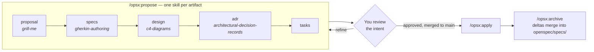
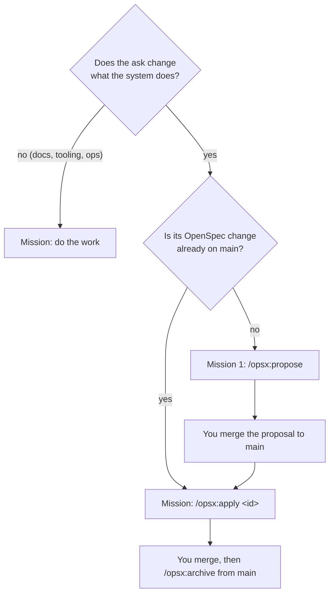
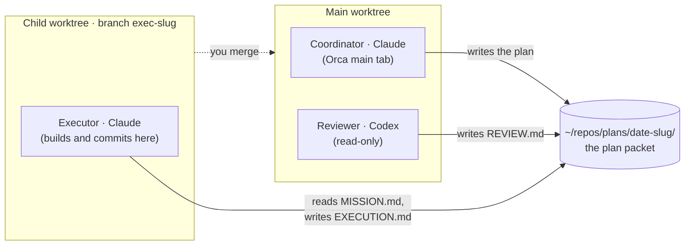
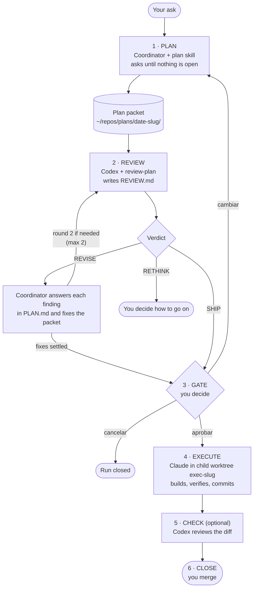
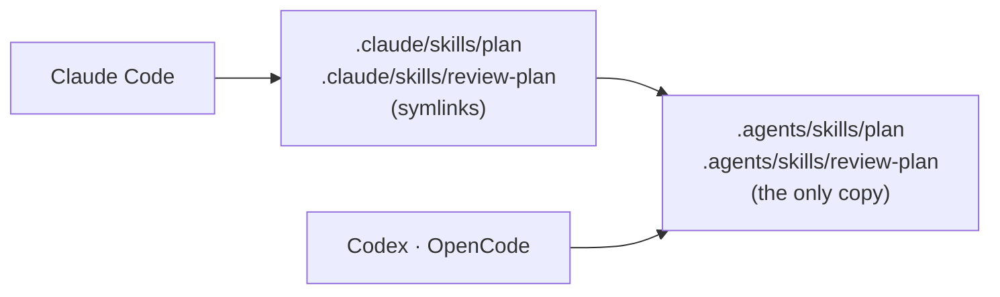

# How it works

The detail behind the [README](../README.md): every framework in the template,
how the OpenSpec loop and orchestration fit together, and what happens inside
an orchestrated run.

- [Setup](#setup)
- [What's inside](#whats-inside)
- [The OpenSpec loop](#the-openspec-loop)
- [How OpenSpec and orchestration fit](#how-openspec-and-orchestration-fit)
- [Orchestration in detail](#orchestration-in-detail)
- [Orchestration setup](#orchestration-setup)
- [Project structure](#project-structure)

---

## Setup

**For the spec-first loop:** Node.js ≥ 20.19, one AI coding tool, and the
OpenSpec CLI.

```bash
npm install -g @fission-ai/openspec@latest
git clone https://github.com/piotromashov/template.git my-project && cd my-project
```

Open it with your agent and ask for a feature; the agent proposes a change
first. With Claude Code or Cursor you can also drive it by hand:
`/opsx:propose "<idea>"`, then `/opsx:apply`, then `/opsx:archive`.

**For your own project:**

1. Replace `PROJECT_NAME` in `CLAUDE.md`, `AGENTS.md`, `agents/AGENTS.md`,
   `agents/MEMORY.md` and `adr/README.md`, and rewrite the README.
2. Fill in the `TODO`s (description, stack, build/run/test). The template is
   MIT-licensed; keep `LICENSE` or replace it with your project's own.
3. Trim `.gitignore` to your stack.

**On Windows**, enable symlinks before cloning
(`git config --global core.symlinks true`, with Developer Mode on) so the
shared skills resolve.

**For orchestrated runs**, see [Orchestration setup](#orchestration-setup).

---

## What's inside

| Framework | What it gives you | Where it lives |
|---|---|---|
| **OpenSpec, `intent-driven` schema** | Artifact chain **proposal → specs → design → adr → tasks**, the `/opsx:*` commands, living specs | `openspec/`, `.claude/commands/opsx/`, `.cursor/` |
| **Bound authoring skills** | One skill per artifact: `grill-me` (proposal), `gherkin-authoring` (specs), `c4-diagrams` (design), `architectural-decision-records` (adr) | `.claude/skills/` |
| **Git discipline** | The gates: a proposal reaches `main` before `apply`; archive only from `main`, after merge | `.claude/skills/openspec-git-discipline/` |
| **Adversarial authoring** | A "model council": an author subagent drafts, a reviewer subagent attacks | `.claude/skills/adversarial-authoring/`, `.claude/agents/` |
| **`plan` / `review-plan`** | Turn an ask into a plan packet another model can execute unattended, then red-team it | `.agents/skills/plan/`, `.agents/skills/review-plan/` |
| **Orchestration** | Playbook for a coordinator agent in Orca: plan, review, human gate, execute, report | [`agents/ORCHESTRATOR.md`](../agents/ORCHESTRATOR.md) |
| **Agent entry points** | `CLAUDE.md` (Claude Code) and `AGENTS.md` (Codex, OpenCode, others) both point to the operating manual | `CLAUDE.md`, `AGENTS.md`, `agents/` |
| **No attribution** | Agents don't add `Co-Authored-By` or "Generated with" lines to commits and PRs | `.claude/settings.json`, `agents/AGENTS.md` |

**Harness support.** Claude Code gets everything. Codex and OpenCode get the
entry point (`AGENTS.md`) and the `plan` / `review-plan` skills. Cursor gets the
core OpenSpec commands and skills (`.cursor/`), but not git discipline,
`bulk-apply`, adversarial authoring or `plan` / `review-plan`.

---

## The OpenSpec loop



You review **intent** (a spec delta) instead of reverse-engineering it from a
diff, and the specs become living documentation of what the system is supposed
to do. The full workflow, the git gates and the safety rules are in
[`agents/AGENTS.md`](../agents/AGENTS.md).

```bash
openspec list            # active changes
openspec list --specs    # current capabilities
openspec validate --all  # check specs/changes for issues
```

---

## How OpenSpec and orchestration fit

A plan packet never replaces an OpenSpec change. When an ask changes what the
system does, the orchestrated mission is either:

- **apply** a change whose proposal is already on `main` (`/opsx:apply <id>`), or
- **propose** it: the executor writes the change's artifacts, you merge them to
  `main`, and a second mission applies it.



The executor follows `agents/AGENTS.md` either way, including the git gates.
After you merge an applied change, run `/opsx:archive` from `main`.

---

## Orchestration in detail

### Words you'll see

| Term | Meaning |
|---|---|
| **[Orca](https://www.onorca.dev/)** | The app that hosts the agents. Each agent runs in its own terminal tab, often in its own git worktree |
| **Main tab** | The Orca terminal where you talk to the coordinator |
| **Run** | One orchestrated objective, e.g. "add CSV export". Holds its tasks |
| **Task** | One unit of work inside a Run: a review round, an execution, a fix |
| **Dispatch** | One attempt of an agent at a task, started with `worker-start`. A failed dispatch can be retried |
| **Worker** | The agent (Codex or Claude) that took a dispatch |
| **Child worktree** | A new git worktree plus branch (`exec-<slug>`) created for the executor, so its changes stay isolated until you merge |
| **Gate** | A blocking question on a task. The execution task can't start until you answer it |
| **`worker_done`** | The message a worker sends when it finishes (`succeeded` or `failed`) |

The coordinator runs the `orca orchestration …` commands itself. The full,
current reference is `orca skills get orchestration --full`.

### The roles

| Role | Who | Does | Never does |
|---|---|---|---|
| **Human** | you | Answers the planning questions, approves at the gate, merges | — |
| **Coordinator** | Claude in Orca's main tab (the most capable model you have), following `agents/ORCHESTRATOR.md` | Plans with the `plan` skill, dispatches reviewer and executor, reconciles the review, reports | Write product code or OpenSpec artifacts, commit, push, merge |
| **Reviewer** | Codex, with the `review-plan` skill, in the coordinator's worktree | Verifies the plan's load-bearing claims read-only, writes a verdict | Edit the plan or any code |
| **Executor** | Claude, with the model and effort the plan picked, in a child worktree | Executes `MISSION.md`, verifies, commits on `exec-<slug>` | Push, merge, change the plan |

Reviewing with a **different model** is the point: it reads the plan cold and
doesn't share the planner's blind spots.

Where each one works, and what it reads and writes:



### The flow



A second review round happens when a blocking finding is still disputed, or
when the accepted fixes change scope, architecture or the model.

Step by step, from your side:

1. **Plan.** Answer the planning questions. The `plan` skill reads the repo
   first and only asks what the evidence can't answer: what "done" means,
   what's out of scope, which permissions the work needs, what must never
   happen.
2. **Review.** The coordinator accepts or rejects each finding and records why
   in `PLAN.md`. It runs a second round when it rejected a blocking finding or
   when the accepted fixes change scope, architecture or the model. After two
   rounds, or on `RETHINK`, it asks you to decide.
3. **Gate.** It shows you the objective, the model it picked, the main risks,
   the findings it rejected, and the authorizations `MISSION.md` claims. Answer
   `aprobar` (approve), `cambiar` (change) or `cancelar` (cancel).
   Authorizations count only because you re-affirm them here; approving is also
   your OK for the executor to commit on its branch.
4. **Execute.** The executor works in the child worktree `exec-<slug>` and
   commits there.
5. **Close.** Read `EXECUTION.md` and the diff, then **you merge** (and run
   `/opsx:archive` from `main` if it applied an OpenSpec change).

`agents/ORCHESTRATOR.md` is written in Spanish (Rioplatense) because it is the
coordinator's own prompt; the gate options stay in Spanish too.

### The plan packet

The `plan` skill writes it **outside any repo**, in
`~/repos/plans/<YYYY-MM-DD>-<slug>/`, so plans never mix with the code they
describe. To use another location, change it in both skills and in
`agents/ORCHESTRATOR.md`.

| File | Written by | Contents |
|---|---|---|
| `ANALYSIS.md` | planner | The evidence: observed facts vs. claims vs. hypotheses, assumptions, rejected alternatives |
| `PLAN.md` | planner | Ordered steps with definition of done, verification and rollback; later, the answer to each review |
| `MISSION.md` | planner | Paste-ready prompt for the executor: objective, decisions already made, authorizations (including "commit on `exec-<slug>`"), hard stops, method. Ends with the `## Ejecución (orquestador)` block: model, effort, scope, verification |
| `REVIEW-BRIEF.md` | planner | Briefing for the attacker: weakest claims first, what was never tested |
| `REVIEW.md` | reviewer | Verdict, verification table, findings `BLOCKING` / `SHOULD-FIX` / `CONSIDER` |
| `REVIEW-1.md` | coordinator | The first round's `REVIEW.md`, renamed before a second round |
| `EXECUTION.md` | executor | What was done, files touched, verification result, deviations, loose ends |
| `REVIEW-diff.md` | reviewer | Optional review of the executor's diff against `MISSION.md` |

For small work the executing agent does itself, the `plan` skill picks *light
mode* and writes only `PLAN.md`. Under orchestration the packet is always
complete.

---

## Orchestration setup

- **[Orca](https://www.onorca.dev/)** with orchestration turned on (Settings → Experimental). Check with
  `orca status --json`.
- **[Claude Code](https://docs.anthropic.com/en/docs/claude-code)** and the
  **[Codex CLI](https://github.com/openai/codex)**, both logged in. Keep Codex
  up to date: an outdated one shows an update dialog that blocks the dispatch.
  Model IDs change and depend on your account; check them with `/model`.
- **A plans directory the agents can write to.** `mkdir -p ~/repos/plans`, then
  add it as a writable root in Codex (`writable_roots` under
  `[sandbox_workspace_write]` in `~/.codex/config.toml`) and as
  `permissions.additionalDirectories` in `~/.claude/settings.json`. Without
  this, the reviewer and executor stop to ask before writing `REVIEW.md` and
  `EXECUTION.md`.
- **A shell that doesn't prompt on start.** With oh-my-zsh, put
  `zstyle ':omz:update' mode disabled` in `~/.zshrc`.

Know the limit on **production writes**: Claude Code's auto mode refuses
commands that change live data even when settings allow them, so plan for a
person to approve those steps in the executor's tab. The *Preflight de
entorno* section of [`agents/ORCHESTRATOR.md`](../agents/ORCHESTRATOR.md)
covers this and every other known way a run gets stuck, with how to recover.

---

## Project structure

```
PROJECT_NAME/
├── README.md             ← quick start
├── CLAUDE.md             ← pointer to agents/ (Claude Code)
├── AGENTS.md             ← same pointer, for Codex, OpenCode and other harnesses
├── docs/how-it-works.md  ← you are here
├── agents/
│   ├── AGENTS.md         ← the rules: workflow, conventions, safety
│   ├── MEMORY.md         ← durable facts & decision log
│   └── ORCHESTRATOR.md   ← coordinator playbook for Orca orchestration
├── openspec/
│   ├── config.yaml       ← active schema (intent-driven) + per-artifact skill rules
│   ├── schemas/          ← the intent-driven schema + artifact templates
│   ├── specs/            ← living specs = WHAT the system does (source of truth)
│   └── changes/          ← in-flight changes; archive/ holds completed ones
├── adr/                  ← durable Architecture Decision Records (immutable)
├── .agents/skills/       ← harness-neutral skills: plan, review-plan
├── .claude/
│   ├── settings.json     ← project settings (commit/PR attribution off)
│   ├── skills/           ← OpenSpec + authoring skills; plan, review-plan link to .agents/
│   ├── commands/opsx/    ← /opsx:* slash commands
│   └── agents/           ← adversarial-author / adversarial-reviewer subagents
├── .cursor/              ← OpenSpec commands + skills for Cursor
└── src/                  ← code (created as features are built)
```

Where knowledge lives: **requirements** → `openspec/specs/`; **how we work** →
`agents/AGENTS.md`; **facts & decisions** → `agents/MEMORY.md`; **plans** →
`~/repos/plans/`, outside the repo. When specs and docs disagree, the spec wins.



**Skills layout.** `plan` and `review-plan` live once, in `.agents/skills/`,
which Codex and OpenCode read; `.claude/skills/` has symlinks to them so Claude
Code sees the same files. On Windows, clone with symlinks enabled
(`git config --global core.symlinks true` and Developer Mode on) or the links
check out as plain text files. If you also keep personal copies in
`~/.claude/skills/` or `~/.agents/skills/`, keep a single source of truth so
they don't drift.
